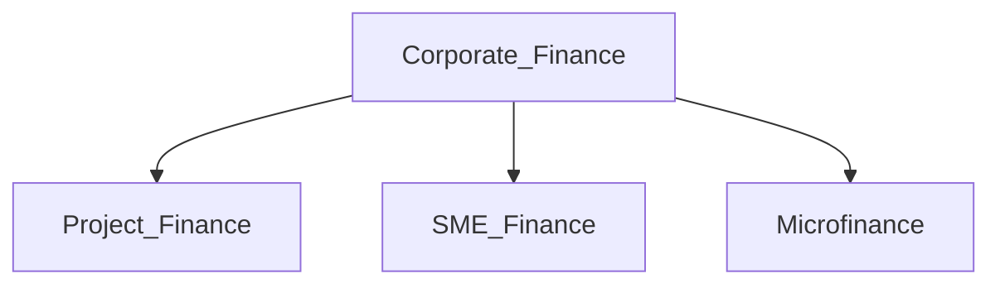
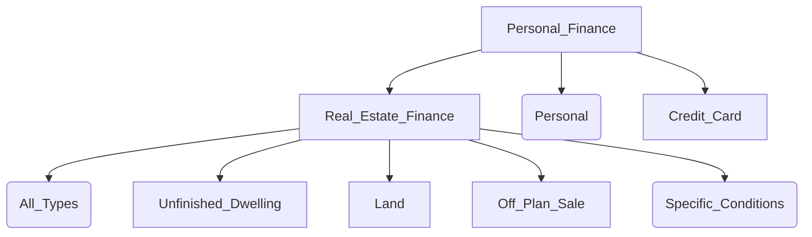
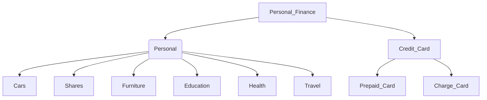

:::info

This Chapter includes about `40` out of `100` MCQs in the exam.

:::

7

Introduction:

This Chapter explains the financing products and services provided by banks and financing companies to individual customers in the Kingdom of Saudi Arabia, including conditions and rules for obtaining financing products in the Kingdom, such as Regulations for Consumer Finance, Implementing Regulations of the Real Estate Finance Law, Standard Form for Contracts of Real Estate Finance (Ijara/ Murabaha), rights and responsibilities of the lessor and lessee under Finance Lease Law, rights and responsibilities associated with financing products, and Rules for Disclosing the Prices of Financing and Savings Products.

## 1.1 Financing Products and Services:

Learning Objective

1.1 To be familiar with types of financing products and services provided by banks and financing companies to individual customers in the Kingdom of Saudi Arabia.

### 1.1.1 Financing Products and Services Rendered by Banks and Financing Companies to Individual Customers:

Financing services and products rendered by banks and financing companies in KSA vary according to requirements and needs of customers. In response to the increasing customers’ demand for banking services and products and in line with the technological evolution in the banking sector, banks competed to provide the best financial services to customers at competitive and reasonable prices, and further expanded in social services programs that significantly enhanced living standards and financial condition for many society groups. Customer’s objectives behind obtaining financing services differ according to his personal purposes, as he may seek an investment (long-term) or commercial business (financing an operational activity) or consumer financing or real estate financing.

This Chapter explores the main financial products and services delivered by banks and financing companies to individual customers within KSA, inter alia:

Credit Card:

A card that enables its holder to obtain in advance money, goods, services or other benefits from businesses accepting such card domestically and internationally, and repay the relevant indebtedness thereafter or in accordance with other arrangements. This definition does not include other types of cards issued such as debit cards, ATM cards and/or prepaid cards.

Credit cards include Visa, MasterCard, American Express...etc. Proceeding of purchases and cash withdrawals shall be within a certain credit limit previously agreed-upon between the customer and the card issuer, so that the customer shall pay the required amount later (upon issuance of the billing statement) either through a single payment or by fulfilling the minimum amount, where the customer may pay the minimum amount (5%) or any sum higher than the minimum amount out of the total amount due. 

8

Types of Finance

Forms of Finance
- Murabaha 
- Ijara Forms of Finance
- Murabaha 
- Ijara 
- Istisna’a (Off-Plan Sale) 
- Musharaka- Finished Dwelling (All Types)
- Unfinished Dwelling 
- Land
- 
- Real Estate Finance
- Consumer Finance (Personal)
- Personal Finance

9

Consumer Finance:

This financing is granted to individuals for satisfying customer needs, and often secured by beneficiary’s salary, or personal or other in-kind guarantees. 

Real Estate Finance:

Finance granted to customers for purposes such as building and purchasing residential and commercial units or buying and developing residential lands and other related activities.

Saudi Central Bank (SAMA) issued an update to the standard form for contracts of real estate finance for individuals, in the forms of Murabaha and Ijara on Jumada al-Akhirah 1441 AH. 

SAMA underlined that all real estate financiers must comply with and not conclude any contracts in any form other than these announced forms or make any amendment thereto after such a date. Such forms will be explained in detail later in this Chapter.

## 1.2 Rules for Obtaining Financing Products:

Learning Objective

To be familiar with Regulations for Issuance and Operations of Credit and Charge Cards

### 1.2.1 Definition of Credit and Charge Cards:

Credit Card:
 
Charge Card:

Below are definitions of some card-related terms:
+ Cardholder: A cardholder may be a natural person or a corporate entity as applicable and shall mean:
 - A holder, or an applicant to become a holder, of a credit or charge card issued by the issuer; or 
 - A holder, or an applicant to become a holder who has agreed with the issuer to pay all obligations arising from the issuance of a supplementary credit or charge card to a designated individual. S/he is the primary cardholder.As defined before, a card issued by a bank in association with credit card associations. The card issued is used by a cardholder to obtain in advance, by virtue of the issuer’s credit, money, goods, services or other benefits from businesses accepting this card domestically and internationally.

Examples of credit cards include VISA and MasterCard, in addition to “Prepaid Card”, which is commonly used by customers, and depends on maintaining a specific amount of money in such card available for use.

A card similar to a credit card but one that requires the charge cardholder to repay the full outstanding amount upon receipt of the account statement or on the due date as per the account statement.

Example of charge cards include American Express.

10

+ Card Issuer: A financial institution licensed to issue credit or charge cards.
+ Card Association: Also known as “Payment Systems Operators” such as VISA, Master Card, American Express, Union Pay and Diners Club or similar institutions.
+ Card Limit: The credit line made available to a credit or charge cardholder under a credit or charge card agreement. 
+ Cash Advance: A transaction to withdraw cash by the cardholder against his/her credit or charge card limit though POS terminals or cash withdrawals at supermarkets (stores).
+ Annual Percentage Rate (APR): Total cost of credit provided to the cardholder under a credit agreement. If the customer uses the entire credit card balance and pays the minimum due without paying the full amount, he will charge the credit card APR on the remainder of the outstanding amount.

Example:

Card Credit Limit     10,000

Purchases (Within a month)   10,000

Minimum Payment (5%)      500

Remaining Amount (The financier will charge the APR on this unpaid amount)   9,500

+ Term Cost: The amount of the term cost payable by the cardholder and it may be represented as a fixed or variable percentage of the outstanding balance on the credit card account.
+ Billing Cycle: The interval between the days or dates of regular periodic statements. These intervals shall be equal and no longer than a quarter of a year. An interval will be considered equal if the number of days in the cycle does not vary more than four days from the regular day or date of the periodic statement.
+ Credit Bureau: An entity authorized to collect and maintain credit information on consumers, and provide respective members with such information upon request. It also offers consumer and commercial credit information services to respective members in the Kingdom of Saudi Arabia.
+ Default: Any breach of the terms and conditions of the credit or charge card agreement and the nonpayment by a cardholder of his/her monthly installment for 90 calendar days from its due date.
+ Default Notice A notice from a card issuer to a cardholder notifying the cardholder that he is delinquent in payments, and such notice is mandatory by the regulator.
+ Fraud: A deliberate act to dishonestly obtain a benefit (e.g. money, a product or a service).
+ Grace Period: The date by which, or the period within which, any credit extended for pur -chases may be repaid without incurring a term cost. If a grace period is not provided, that fact must be disclosed. If the length of the grace period varies, the card issuer must disclose the range of days or the minimum number of days in the grace period, if the disclosure is identified as a range or minimum.
+ Initial Disclosure: The information required to be provided to the cardholder by a card issuer upon opening credit or charge card account.
+ Outsourcing: An arrangement under which a third party (i.e. the service provider) undertakes

11

to provide to a card issuer a service previously carried out by the card issuer itself or a new service to be launched by the card issuer. Outsourcing can be made to a service provider in Saudi Arabia or overseas and the service provider may be a unit of the same card issuer (e.g. head office or an overseas branch), an affiliated company of the card issuer’s group or an independent third party and is subject to the requirement to fully comply with SAMA Rules on Outsourcing.
+ Satisfactorily Resolved: Resolution of the error/dispute in accordance with the procedures and timeframes for resolving disputes in accordance with instructions of SAMA, card associations, or payment systems operators.
+ Unauthorized Use: The use of a card by a person, other than the cardholder, who does not have actual, implied, designated or apparent authority for such use, including card skimming.

### 1.2.2 Regulations for Issuance and Operations of Credit and Charge Cards:

SAMA issued the Regulations for Issuance and Operations of Credit and Charge Cards in April 2015, superseding the Regulations issued in 2008. The updated Regulations included new rules that would enhance the level of protection for credit and charge cardholders and foster principles of transparency and disclosure in so far as to make the beneficiary aware of his rights and responsibilities clearly and facilitate comparison and selection of the most suitable 
services provided by the licensed entities. The most prominent updated regulations include:
1. Summary of Credit or Charge Card Agreement: Card issuers must provide to the customer a summary covering the basic information and the main provisions of the credit or charge card agreement, in a language clear to the cardholder.
1. Transparency and Disclosure: The card issuer shall fulfill principles of transparency and disclosure in advertising and marketing of products without misleading and determine minimum data required for agreements. The issuer should disclose all fees and commissions associated with the card. 
1. Objection Requirements: The agreement must include clear procedures for cardholder customers in case of objection to irregular operations.
1. Annual Percentage Rate: The card issuer should develop criteria for calculating the internationally recognized APR for announcing the true cost of financing.
1. Fees and Commissions: Annual charges determined according to the type of card to be paid by the cardholder to the card issuer, including the maximum cash withdrawal limit and the maximum defaulting fees.
1. Rules and Criteria for Dealing with Customer: The card issuer shall establish a set of rules for dealing with customers, including serving a notification thereto of any changes made to the agreement and obtaining his approval when necessary.
1. The cardholder shall be responsible for transactions exceeding the card credit limit and the amount of unauthorized transactions recorded on his account.

12 

### 1.2.3 Issuance of Credit and Charge Cards

General Requirements: 

The credit or charge card issuer shall meet the following general requirements:
1. All credit agreements, application forms, guarantee agreements, repayment schedules and other documentation related to credit and charge cards should be in Arabic. An English copy of these documents shall also be made available to the cardholder if requested. In case of conflict between the Arabic and English text of any of such documents, the Arabic text shall prevail.
2. The cardholder rights and responsibilities relating to the credit or charge card shall be recorded in the “Cardholder Agreement” that shall meet SAMA information disclosure requirements. 
3. All card issuers must fully comply with the international rules and procedures agreed with the relevant card associations according to Regulations for Issuance and Operations of Credit and Charge Cards issued by SAMA.
4. A card issuer may not issue a credit or charge card without receiving a signed application from an applicant.
5. The decision to issue new credit or charge cards requires an effective risk management strategy to enable an assessment of eligibility and suitability of credit or charge cardholder.

Card Issuance Procedures:

When assessing applications, card issuers must perform the following:
1. Verify that the financial information and applicant personal details supplied on the application form are correct.
2. Consider the probability of the applicant’s ability to repay any indebtedness.
3. Determine the amount that the applicant can pay.
4. The FI may not issue a credit or charge card to anyone under the age of eighteen (according to the Hijri date), unless such card is an additional one (according to certain conditions).

The minimum gross salary eligibility for new credit cardholders shall be set at SAR 24,000 per annum for bank customers and SAR 30,000 for non-bank customers.

Issuance of Replacement Cards:

A replacement credit or charge card with a new validity period may be issued by a card issuer to a cardholder in the following scenarios:
1. The card has been reported as lost, stolen or damaged.
2. The card has been invalidated on suspicion of a fraud or suspicious transaction.
3. The validity period of the card is due to expire, and the replacement card is of the same type as the credit or charge card so replaced.
4. Any other technical reasons including systems and technology enhancements.
5. The account is not delinquent.
6. A Co-branded card, affinity card or private label card has terminated and a replacement card is issued according to the provisions of the original card agreement between the card issuer and the cardholder.
7. New or updated requirements and Regulations.

The cardholder has the right to accept or reject the replacement card. The cardholder shall be

13

deemed to have given their consent if they do not express an objection within 2 weeks from his notification, or activate the replacement credit or charge card.

A replacement card shall be treated as being of the same kind as the credit or charg e card being replaced including the type of card, terms of use, branding. Any fees and terms cost relating to the original card held by the cardholder will apply to the replacement card. The only exception will be where the cardholder has applied for and activated an upgraded card.

Issuance of Supplementary Cards:

The supplementary card maybe issued at the primary cardholder’s request to issue a supplementary card under their account, to their designated individual. The primary cardholder shall be liable for all liabilities incurred under the supplementary card, including any outstanding and or unpaid balances. Supplementary cards shall be issued in accordance with the Regulations for Issuance and Operations of Credit and Charge Cards.

### 1.2.4 Credit Limits of Cards:

When setting initial credit limits, a card issuer needs to apply “Responsible Financing Principles”: Issued by SAMA pursuant to Circular No. (99/46538) dated 15/05/2018 AD (02/09/1439 AH), as amended by Circular No. (1/40694) dated 24/ 05/2018 AD (09/09/1439 AH).

Responsible Lending Principles for Individual Customers defined “Monthly Credit Obligations as: Total amount payable by the consumer , which is calculated on a monthly basis, as per the credit report issued by licensed credit bureaus and the consumer ’s disclosure.”

+ Account behavior information e.g. typical value of transactions and timeliness of repayments. 
+ A card issuer may not issue or permanently increase the credit limit of an existing creditor charge card without seeking the cardholder’s credit records from a licensed credit information bureau. Further, cardholder’s approval must be obtained.
+ A card issuer is required to carry out proper risk management procedures including the useof credit scoring models, delinquency behavior etc., for issuance and renewal of credit orcharge cards so as to assign appropriate credit limits to the cardholder
+ Where a cardholder has not made the full minimum monthly repayment on 3 consecutive occasions, the card issuer may immediately:
  + Freeze the account and treat it as a delinquent account.
  + Offer the credit advisory services free of charge to the cardholder.
  + Work towards a mediated settlement before implementing collection and legal system against the cardholder.
+ A card issuer must deal directly with a defaulting cardholder during this time.
+ A card issuer is not allowed to lower the minimum monthly repayment required from its cardholder below 5% of the outstanding balance as on the credit card account.
+ The card issuer shall close the credit or charge card account upon receipt of a requestfrom a cardholder seeking such closure through an approved communication mean afterthe full and final repayment of the outstanding amount on such card.
+ The finance company shall execute consumer request by issuing a clearance letter for any purpose, including salary transfer – in case there are no outstanding financial obligations onsuch consumer, within a period not exceeding one (1) business day from the date of receivingthe request, and seven (7) business days for consumers holding credit and/or charge card.

14

### 1.2.5 Information Disclosure

Initial Disclosure: 

A card issuer that proposes to enter into a credit or charge card agreement with a cardholder must provide an initial disclosure. The disclosure must be clear and easy to understand and the card issuer must use any format specified by SAMA from time to time for that purpose.

Further, the card issuer should provide the initial disclosure to the cardholder according to SAMA’s instructions.

The initial disclosure must include the following information as a minimum:
+ The initial credit limit, if it is known at the time the disclosure is made.
+ The APR and the annual term cost.
+ The nature and amounts of any recurring non-term cost charges.
+ The minimum payment during each payment period and the method for determining it. 
+ Each period for which a statement of account is to be provided.
+ The date on and after which, commissions or profits accrue and information concerning any grace period that applies.
+ The particulars of all fees and charges.
+ Information about any optional feature in relation to the credit or charge card agreement that the cardholder accepts in writing. In addition to fees for each optional feature, and cases where the cardholder may cancel any feature.
+ The manner in which the term cost is calculated.
+ The cardholder is required by the credit or charge card agreement to pay the outstanding balance in full on receiving a statement of account.
+ Information on all applicable charges including reporting of default cases to a licensed credit information bureau or appropriate regulatory authorities as per SAMA’s approval.
+ An illustrative example of calculations depicting sample conversion of foreign currency charges into Saudi Riyal, showing the foreign exchange conversion fees used when the card issuer converts a foreign transaction back to Saudi Riyal. The calculations should include one foreign currency purchase transaction and one cash advance transaction at an ATM/POS outside of Saudi Arabia.
+ An initial disclosure may be part of a credit or charge card agreement or an application for a credit or charge card or may be an annex to the foregoing documents.
+ If the initial credit limit is not known when the initial disclosure is made, the card issuer must disclose it.

General Disclosures:
+ Card issuers must include a summary covering the basic information regarding the credit or charge card product and the main provisions of the credit or charge card agreement, in a language clear to the cardholder and in accordance with the format stipulated by SAMA. The cardholder’s receipt of such summary shall be documented in the cardholder record.
+ If a credit or charge card agreement is amended, the card issuer must, at least 30 calendar days before the amendment takes effect, disclose to the cardholder, any changes to the agreement.
+ The card issuer shall mail or deliver to the cardholder, the monthly account statement at least three weeks prior to due date.
+ TA card issuer should include specific warning statements in all agreements indicting consequences that the cardholder shall be responsible for in the event of:
1. Failure to meet the terms of credit or charge card as agreed in the agreement.
2. Failure to pay the monthly minimum amount.

Disclosure of Fees, Commissions and Charges:
+ Details of foreign currency transactions, including conversion rate, fees and all charges levied on the foreign currency transaction, must be displayed on the transaction record in the cardholder’s monthly statement, in the manner stipulated by SAMA.
+ If a card issuer offers to defer or skip a payment under a credit or charge card agreement, the card issuer must, with the offer, disclose in a prominent manner whether term cost will continue to accrue or if any additional charges will accrue during any period covered by the offer, if the offer is accepted.

### 1.2.6 Rights and Responsibilities of the Cardholder:

+ Cardholders may terminate the relevant credit or charge card agreement if they do not agree to any amendment, change or modification by notifying the card issuer of their desire to terminate the credit or charge card agreement within 14 calendar days after their receipt through a guaranteed mean and after paying the outstanding amount in the card account.
+ The cardholder is required to keep the card issuer’s records updated with their latest address and to immediately notify the card issuer, through any reliable mean of communication, of any change in their contact details.
+ A card issuer may allow its cardholder to process a cash advance using their credit or charge cards up to a maximum of 30% of their credit limit. ATM cash withdrawals are subject to limits that pertain in the jurisdiction where the cardholder is making the cash withdrawal.
+ The cardholder has the right to, within 10 days of receiving a credit or charge card, cancel it free of change and the card issuer will not claim any fee unless the cardholder has activated the card by any possible means, such as calling the free phone or internet service and requesting the activation of the card.
+ Card issuers must regularly issue to cardholders regular SMS, email and other electronic communication awareness messages regarding paying the outstanding amount in time. 
+ A card issuer should emphasize to merchant customers that they cannot pass on or impose any additional fees or charges when cardholders use a credit or charge card in their stores.
+ Card issuers must issue an SMS message to cardholders advising when a debit or credit transaction has been processed on the account of the card.
+ Card issuers are prohibited from increasing the term cost on an existing outstanding balance as a result of delinquency or default.
+ Late payment fees must not exceed SAR 100, provided that the amount of the late payment fee cannot exceed the outstanding amount.
+ A card issuer must inform cardholders about outstanding transactions and request payment within a maximum of 90 days from the original date of the transaction. After that, the card issuers can only debit a cardholder’s account for payment after obtaining documented approval from the cardholder.
+ A card issuer is required to implement a clearly defined Code of Conduct for employees engaged in cards business and must obtain their acknowledgement of receipt.
+ Credit and/or charge card outstanding amount must be due on the same date each month and payments received up to and including midnight on the due date must be treated as

16

timely. Card issuers cannot charge a late payment fee unless cardholders are given at least 21 days to pay their due amount.

+ Cash advance fees must not exceed:
  - SAR 75 for cash advance transaction up to SAR 5000.
  - 3% of transaction amount over SAR 5000, and subject to a maximum of SAR 300. 

VAT must be calculated on the fee amount.

+ Card issuers are prohibited from imposing any fees for transfer transactions between cardholder’s current account and the cardholder’s credit or charge card account at the same bank.
+ Card issuers must send a notification (SMS message though a guaranteed mean) to cardholders, one month before expiry of reward points, and repeat one week before expiry date, advising the cardholder of the number of points due to expire and the expiry date.

### 1.2.7 Resolution of Card-Related Disputes:

Card issuers must have a comprehensive dispute resolution policy and procedures (also known as complaint handling policy and procedures) and comply with SAMA Regulations for complaint handling departments. A copy of the card issuer’s complaint handling policy and procedures must clearly be on display in all of their branches and on their websites and they must provide a hard copy to a cardholder if requested. Most critical dispute resolution rules include:

1. The card issuer must mail or deliver a response to the cardholder within 30 calendar days of receiving the notice of “account statement error/dispute” advising the cardholder of the likely timeframe of resolution of the error/dispute and requesting any additional available information or documentation.
2. The credit or charge card issuer shall conduct necessary investigation and comply with the appropriate dispute resolution procedures within two complete account statement cycles, but in no case shall be later than 90 calendar days as of the date of receiving the notice of account statement error/disputed transaction.
3. If the account statement error/disputed transaction has not been satisfactorily resolved, the cardholder shall not be obliged to pay the portion of the required payment that the cardholder believes is related to the disputed amount, including term cost or fees.
4. The card issuer shall not make an improper report about the cardholder’s credit standing, or report that an amount or account is delinquent prior to the error/disputed being satisfactorily resolved.
5. If the credit or charge card issuer determines that an account statement error has occurred as stated by the cardholder, it shall correct the error and pay back any disputed amount and relevant term cost and fees debited on the cardholder’s account.
6. If the card issuer determines that no account statement error has occurred, it shall mail or deliver an explanation of the reasons for believing that the error alleged by the cardholder is incorrect and provide the cardholder with copies of any documented evidence, if requested.
7. If the credit or charge card issuer deems that a cardholder is liable for all or part of the disputed amount and relevant term cost and fees, it must:
   + Notify the cardholder of the date when payment is due and the portion of the disputed amount and relevant term cost and fees that the cardholder is liable for.
   + Report to a licensed credit information bureau that an account or amount is delinquent because the amount due has remained unpaid after the due date given by the credit or charge card issuer as defined in the terms and conditions of the cardholder agreement in force

17

## 1.3 Regulations for Consumer Finance:

Learning Objective

To be familiar with regulations for consumer finance 

### 1.3.1 Regulations for Consumer Finance:

Financing granted to individuals dealing with FIs for nonbusiness purposes i.e. unconnected with the borrower’s commercial or professional activity, generally including personal financing, overdraft facilities, car financing, credit card payment, finance lease, and other related activities. Such financing includes loans for financing the purchase of goods and services for leisure, consumption or other needs of individuals as mentioned earlier, e.g. for the purchase of furniture or cover leave or education expenses. Consumer financing includes real estate restoration financing except mortgage loans.

SAMA issued the first update of Regulations for Consumer Finance, which included prominent changes, inter alia:

1. Transparency and Disclosure: 

Setting the minimum information to be indicated in consumer financing contracts including: 

Advertising Consumer Financing Products: Regulations of consumer financing that should be adhered to by the creditor include:
+ The creditor must indicate in all product advertisements its name, logo, any identifying representation and contact details. The advertisement must disclose, in a manner that is clear to the borrower, the name and Annual Percentage Rate of the advertised product and shall not include other rates such as the term cost.
+ The creditor must provide the borrower with a written disclosure statement that provides the information required be disclosed. A disclosure statement may be part of a financing contract or an application for a consumer financing or may be an annex to the foregoing documents.
+ Sharing Information between creditors and borrowers: the creditor should provide the borrower with full and accurate information required for the financing agreement. The borrower and the guarantor must accurately and completely produce any information necessary in this regard.
+ Non-interest based products: Documentation required for the purchase and sale of goods shall comply with requirements of the bank’s Shariah Board.
+ The creditor should provide customers with all documents related to the financing contracts, repayment schedules and borrower acknowledgement letters.
+ The creditor must register the purpose of all personal loans, and take measures to ensure such loans are used for the intended purposes.

2. Confidentiality or Privacy of Information: 
+ Personal information of the borrower, guarantor or other individuals required to conclude financing contracts should be kept confidential. Such information may not be processed unless for evaluating the financial position of such individuals and their capability to fulfill the agreed-upon finance.

18

+ Saudi Credit Bureau (SIMAH) operates a central database for the purpose of registering and recording the credit data of borrowers and guarantors. All banks must refer to the database before carrying out any commitment to the borrower or guarantor. Further, the personal data obtained may only be used for evaluating the financial position of the borrower and guarantor and their capability for payment.

3) Necessary Content of Financing Contracts or Guarantee Agreements:

+ Names of the parties to the financing contract, i.e. the creditor, borrower, and guarantor.
+ APR of charge and the term cost or profit calculated and specified at the time of concluding the financing contract. The actual borrowing cost and the comparability should be indicated. APR must include all mandatory charges or costs under a consumer financing as shown in the relevant advertising notices or materials.
+ The financing contract must stipulate the use of the declining balance method in distributing the term cost over the maturity period, which means that the term cost is allocated pro-rata to installments based on the remaining balance of the amount of financing at the beginning of the period for which an installment is due.
+ All fees, costs and administrative services charges to be recovered from the borrower by the creditor must not exceed the equivalent of (1%) of the amount of financing or SAR 5,000 (five thousand Saudi Riyals), whichever is lower, in addition to calculating VAT on the fee amount.
+ Statement of account in the form of repayment schedule if the financing contract involves capital amortization, in addition to outstanding payments, timeframes and repayment-related terms.
+ A statement indicating the periods and conditions for repaying the borrowing costs or profit and the recurring and non-recurring fees associated with it if there are special fees, commissions or profit to be paid without amortizing the capital.
+ Early payment or partial payment procedures and provisions and fees (if any) that must be paid by the borrowers to exercise such right. The creditor must accept any payment under a financing contract before its due date as partial payment if it is equivalent to one full installment or multiples thereof. The borrower may also pay the entire remaining amount of financing if he desires to do so (and enjoy early payment discounts). (Examples of early repayment in Appendix No. 1)
+ Terms, conditions and procedures to be applied and fees to be paid if the borrower exercises the right to drawdown any part of the amount of financing or has made partial, late or deferred payments. In the event of termination, the creditor may not charge or claim any term cost and or fees from the borrower unless the following conditions have been met:
1. Draw-down of any part of the amount of financing has occurred.
2. A credit card or other means of obtaining financing has been used to acquire goods or services for which financing is to be advanced under the financing contract.
+ In case of secured financing, the description of the asset that guarantees financing must be indicated, and borrowers must undertake to maintain the collateral assets so as to be available to the creditor in the event of default.
+ Right of Withdrawal: 

Except in non-interest based transactions, the borrower may, without producing any

19

justifications and within 10 calendar days from the date of execution of a financing contract, terminate the financing contract. Exercising the right of withdrawal obliges the borrower to return to the creditor any cash sums obtained under the financing contract and the borrower shall pay any due charges or profits against the period in which the amount of financing was withdrawn calculated based upon the agreedupon APR of charges. The creditor may not claim any further withdrawal-related charges and should immediately return to the borrower any payment made by him in advance under the financing agreement.

4) Annual Percentage Rate (APR), Finance Charge Rate (FCR), and Profit Rate (PR):

+ The APR and the Profit Rate:
Criteria have been set for calculating APR, which is an internationally recognized indicator to disclose the actual cost of financing, including all administrative costs and fees. APR of charge must reflect all mandatory expenses or unavoidable costs involved in any transaction as shown in advertisements or by other means. For non-interest based products, a similar methodology shall be utilized, i.e. for related and similar cash flows, withdrawals, payments and other fees for the purpose of calculating APR of charge. The total cost of financing for the borrower shall be determined including all mandatory costs except for fees payable by the borrower against violation of any of financing contract conditions. APR of charge shall be calculated based on the assumption that the financing contract will remain in effect for the agreed term and both the borrower and creditor will fulfill their obligations under the agreed terms and conditions.

+ Finance Charge Rate: 

Finance Charge Rate may be fixed or variable. The borrower must be notified in writing or via any other reliable means of any change in Finance Charge Rate. Such notification should include new APR, new total Finance Charge Rate set by the creditor, as well as the new schedule for debt amortization if so applied. 

+ Profit Rate: 
Profit Rate shall apply to all types of financing under all non-interest based financing contracts. Profit Rate means the rate used so as to generate profits from the invested funds, which also represent the Annual Percentage Rate.

5) Unfair Conditions:
The consumer-finance contract or guarantee agreement is considered unfair if it aims or may cause harm to the economic or other interests of the borrower, particularly if any of the following conditions are applied:
+ Changing any contractual expenses, compensation, or fees other than Financial Charge Rate or Profit Rate. 
+ Introducing conditions on the possibility of changing Financial Charge Rate or Profit Rate that prejudice the right of the borrower.
+ Applying methods that involve Financial Charge Rate or variable Profit Rates that have no connection to the net initial Financial Charge Rate or the proposed Pofit Rate at the time of concluding the financing contract.
+ Obliging the borrower to deal with the same creditor to refinance the remaining value or to finance the last installment of the financing contract for purchasing movable property or services.
+ Obliging the borrower – except for trade margin – as a condition for withdrawal, to leave as collateral all or part of the amounts borrowed or granted, or use all or part of such amounts to form a deposit or purchase securities or other financial instruments, unless the borrower gets the same currency price for the deposit, purchase or collateral such as the agreed APR of charge.
+ The borrower or guarantor shall not be required to sign a check guaranteeing payment of the amount due in whole or in part.

20

## 1.4 Implementing Regulations of the Real Estate Finance Law:

Learning Objective

To be familiar with the Implementing Regulations of the Real Estate Finance Law 

Real estate finance is the finance granted to customers for purposes of building, purchasing residential and commercial units or purchasing, developing residential lands and other related activities conducted by companies authorized by SAMA. The Implementing Regulations of the Real Estate Finance Law included controls for real estate financing, but first let us have a look on the most important terms in real estate finance:
+ Real Estate Finance: Extending credit to a borrower for the purpose of owning a dwelling.
+ Real Estate Finance Contract: A deferred payment contract extended to a borrower to own a dwelling.
+ Real Estate Finance Contractual Rights: cash flows, mortgages, collaterals and other rights arising under a real estate finance contract.
+ Real Estate Finance Entity: commercial banks and real estate finance companies licensed to engage in real estate finance activity.
+ Borrower: a natural person who obtains real estate finance.
+ Consumer: any person targeted by real estate finance services.
+ Housing Subsidy: a financial or credit subsidy provided by the government, housing societies, or the like to make housing affordable.
+ Real Estate Refinance Company: a joint stock company licensed to engage in real estate refinance activities.

SAMA shall, pursuant to the Real Estate Finance Law and Implementing Regulations thereof, regulate the real estate finance sector. For this purpose, SAMA may:
1. License real estate finance companies to engage in real estate finance activities in accordance with the provisions of the Real Estate Finance Law, Finance Companies Control Law and their regulations.
2. Allow banks to engage in real estate finance activities through the ownership of dwellings for finance purposes, in accordance with the Real Estate Finance Law and Implementing Regulations thereof.
3. License a joint stock company (or more) for real estate refinance according to market needs. The Public Investment Fund may become a co-owner of such company. SAMA shall approve nominations for board membership. Licensed finance entities may also become co-owners of such company. A portion of the shares of the company shall be offered to the public in accordance with the Capital Market Law.
4. License cooperative insurance companies to cover real estate finance risks in accordance with the Cooperative Insurance Companies Control Law.
5. Issue real estate finance standards and procedures, review real estate finance contract templates issued by the real estate finance entities and ensure their compliance with such standards and procedures and their provision of required protection to consumers and borrowers.
6. Publish data related to real estate finance market and sponsor development of real estate finance technologies, including technologies to facilitate the flow of data between primary and secondary markets.
7. Determine the principles for the disclosure of finance cost and method of its calculation to enable consumers to compare prices.
8. Take the necessary measures to maintain the sector integrity and stability and fairness of transactions concluded therein.
9. Take necessary measures for promoting fair and effective competition between real estate finance entities. 
10. Adopt proper means for the development of the sector, Saudization, and raising employees’ competency through regulating obligations of the real estate finance entities regarding training of human resources, improving their skills and developing their knowledge.

## 1.5 Standard Form for Contracts of Real Estate Finance (Murabaha and Ijara):

Learning Objective

To be familiar with the standard form for contracts of real estate finance (Murabaha and Ijara):

KSA financing companies adopts two main forms of real estate financing in compliance with provisions of Islamic Sharia, namely “Ijara” and “Murabaha”. The cost of current real estate finance contracts in the form of Ijara is variable, as their interest rate is associated with a reference index called “SIBOR”, which is usually for a period of one year or 12 months. The contract is re-evaluated at the end of each lease period according to SIBOR changes due to factors related to liquidity and overall economic status.

However, the cost of current real estate finance contracts in the form of Murabaha is fixed, as their interest rate is predetermined when the contract is concluded, and remains unchanged throughout the term of the contract.

SAMA issued an update of the standard forms of the real estate contract in Murabahah for individuals, and real estate contract in Ijarah for individuals. Real estate financiers must abide by these updated forms and may not conclude any contracts in violation of these forms or make any amendments thereto after issuing these forms on Jumada al-Thani 1441 AH.

22

### 1.5.1 Key Controls and Differences between Murabaha and Ijara:

| Finance Aspect | Murabaha | Ijarah |
|-|-|-|
| Form Mechanism | <ul><li>The finance company mediates the purchase of a commodity at the request of the customer, and then sells such commodity to him on credit at a price equal to the total cost of such purchase plus a known profit agreed upon between them. Total purchase cost is the purchase price of commodity plus all expenses paid by the financing company to acquire such commodity, minus any charge (discount) obtained by the bank from the seller. Thus, the amount of Murabaha is the total cost of the purchase plus the profit of the bank.</li><li>The real estate financing contract in the form of Murabaha includes the borrower’s request from the financier to finance the purchase of financed asset described in Murabaha contract at a price stated in such contract, in accordance with terms and conditions thereof.</li></ul> | <ul><li>Each contract in which the lessor (finance company) leases fixed or movable assets, rights, services or intangible rights in the lessor’s capacity as owner or owner of proceeds thereof, or a person able to own or produce such assets, provided that the lessor has obtained such assets for the purpose of leasing them, as a business, to a third party.</li><li>The real estate finance contract in the form of lease includes a request from someone called “the promisor” to the finance entity that owns the property indicated in the contract promising him to lease such property under a finance lease at the price indicated in the contract and in accordance with terms and conditions thereof.</li></ul> |
| Ownership of Leased Assets | The beneficiary undertakes to pledge the funded asset to the financier in order to ensure that the beneficiary fulfills the payable forward installments under Murabaha contract, once the funded asset is evicted, in accordance with the Registered Real Estate Mortgage Law. The beneficiary shall preserve, maintain and protect the financed asset against damage, and may not make substantial modifications thereto or do anything that substantially affects its value as a mortgaged asset without obtaining the financier’s approval. | The lessor shall be the owner of the leased asset for the term of contract and until the lessee pays all the amounts payable by him. Save for the promise to own under the contract, the lessee has no right or interest in the leased asset other than being a lessee thereof. |
 

23

| Finance Aspect | Murabaha | Ijarah |
|-|-|-|
| Profit Margin | Fixed throughout finance term | Variable unless both parties agree otherwise. |
| Use of Asset | The financier shall transfer the ownership of the financed asset, evict and hand it over to the beneficiary, and take all necessary measures to register the ownership for the benefit of beneficiary within (15) working days from the commencement date of contract, unless there is a reason beyond the financier’s control that prevents handover or eviction of the financed asset on time. | The lessor shall handover the leased asset to the lessee on the date of making the leased asset available, no later than (15) working days from the date of making the leased asset available, unless there is a reason beyond the lessor’s control that prevents handover of the leased asset to the lessee. |
| Installments | Fixed (Number & Value) | Variable (Unless both two parties agree on a fixed margin) |
| Insurance Fee | Incurred by finance company | Incurred by finance company |
| Maintenance | Incurred by customer, whether operational or basic maintenance | The customer may not dispose of the asset except after obtaining approval of the finance company. |
| Disposal of Asset | The customer may not dispose of the asset except after obtaining approval of the finance company.| The customer may not dispose of the asset except after obtaining approval of the finance company. |
| Transfer of Ownership | The financier shall release the mortgage on the financed asset once the beneficiary fulfills all obligations under the contract within a period not exceeding 15 business days from the date of last installment or final payment. | • The lessor may promise to transfer the ownership of leased asset at the end of contract to the lessee by way of sale by signing the ownership transfer certificate, provided that the lessee pays all the amounts payable by him, in addition to the last payment, if any. • The other way: the lessor promises to transfer the ownership of the leased asset at the end of contract term as a gift by signing the ownership transfer certificate, after the 
lessee has paid all the amounts payable by him under Ijarah. |

| Finance Aspect | Murabaha | Ijarah |
|-|-|-|
| Payment of future installments | The beneficiary shall pay to the financier the future installments (in addition to any government fees) on a regular basis. The financier may, by the authorization of beneficiary, deduct the future installments from the monthly salary of lessee when made available. | The beneficiary shall pay to the financier the future installments (in addition to any government fees) on a regular basis. The financier may, by the authorization of beneficiary, deduct the future installments from the monthly salary of lessee when made available. |
| Delay of Rent Payments: | The beneficiary shall be considered in violation of the contract if • failed to make three consecutive payments or delayed in making five separate payments throughout the contract term. However, the last attempt to contact the customer shall be through national address. • Five interrupted lease payments for a period of (7) working days or above for each payment as from its due date for each (5) five years of the contract term. The Financier: sends a default notice indicating that there are overdue payments have to be made. If the lessee fails to pay the due payments, the lessor may consider the lessee as delinquent | The lessee shall be considered in violation of the contract if • failed to make three consecutive payments or delayed in making five separate payments throughout the contract term. However, the last attempt to contact the customer shall be through national address. • Five interrupted lease payments for a period of (7) working days or above for each payment as from its due date for each (5) five years of the contract term. The lessor sends a default notice indicating that there are overdue payments have to be made. If the lessee fails to pay the due payments, the lessor may consider the lessee as delinquent, and may terminate the contract, requesting the lessee to vacate and return the leased asset. The lessor may then request the following from the lessee: 1. Outstanding and unpaid lease payments until the date of termination of contract. 2. The cost of evicting the leased asset, and the value of repairing any substantial damage to the leased asset arising from the lessee’s failure to maintain it. 3. The amount payable for using the leased asset from the date of termination until the date of receipt of the leased asset. |

The customer incurs operational maintenance and finance company incurs basic maintenance.
 
24

| Finance Aspect | Murabaha | Ijarah |
|-|-|-|
| Early ownership of asset | The lessee may, at any time, request early ownership within a period not less than 10 days before the date of rent payment. In this case, the lessor may obtain from the lessee the following amounts (value of early ownership): • Payable and unpaid rental payments.• The outstanding amounts of financing. • The cost of reinvesting, not exceeding the term cost of three month payments following the last rental payment due before the lessee submits an early ownership request. • Non-refundable expenses that the lessor pays to third parties under such process. | The lessee may, at any time, request early ownership within a period not less than 10 days before the date of rent payment. In this case, the lessor may obtain from the lessee the following amounts (value of early ownership): • Payable and unpaid rental payments. • The outstanding amounts of financing. • The cost of reinvesting, not exceeding the term cost of three-month payments following the last rental payment due before the lessee submits an early ownership request. • Non-refundable expenses that the lessor pays to third parties under such process. Notwithstanding the above, the contract may specify a period during which early ownership is prohibited, if the subject matter of contract is real estate property and this condition entails a deduction from the term cost, provided that the prohibition period does not exceed two years from the date of concluding the contract. |

25

26

### 1.5.2 Instructions for Providing Real Estate Finance Product (Murabaha/Ijara) for Individual Customers:

To regulate finance products, SAMA clarified some instructions to set the minimum provisions that finance companies must fulfill when providing a real estate product to individual customers. Through this, SAMA helps customers take appropriate decision when requesting real estate finance, protects rights of all parties, and fosters safety of real estate finance sector. 

Such instructions apply to banks real estate finance companies subject to SAMA’s supervision. 

The instructions include:
1. When a customer applies for a real estate finance product, the financier shall request and examine the information necessary to know the customer’s financial conditions and develop a clear picture of the customer’s ability to meet the associated finance obligations, thus enabling the financier to develop an image on suitability of such product to such customer. The financier may not offer a real estate finance if results of such examination on customer’s ability to meet associated obligations do not comply with the financier policies to extend credit. 
2. The financier shall provide an explanation to the customer about the proposed real estate finance product, clarifying the terms and conditions of the finance contract to be signed, especially risks associated with the product. A responsible and specialized official shall present and discuss this explanation with the Customer and answer to all of its queries. The explanation and discussion must be in a language that the Customer understands in a simplified and clear manner. The supplier shall document the submission of this explanation. The financier may not offer a real estate finance unless after ensuring that the customer is aware of terms and conditions of the required finance and any associated risks.
3. The financier shall submit to the customer a real estate finance offer with a validity period of no less than fifteen (15) business days from the date of delivery to the customer. 

The offer may be in the form a printed or electronic document containing all details and documents in the same form that would be signed if the real estate finance contract is concluded. The following documents shall be included in the submitted offer:
+ The real estate finance contract and attachments thereto.
+ Disclosure form for real estate finance offer according to the form below (Appendix No. 2). 
+ Acknowledgment form for accepting the credit risk of real estate finance with variable term cost, for real estate products with variable cost. (Appendix No. 2). 
+ The financier must document the customer’s receipt of such documents, whether they were submitted to him in paper or electronically. The financier shall enable the customer, if he prefers the printed offer, to retrieve such documents from the financier’s office. 

The customer may present those documents to whomever he wants to request their opinion and advice. The financier may not conclude any real estate finance contract unless after submitting to and enabling the customer to retrieve such documents from the financier’s premises.
+ The financier shall, in a sufficient period before the expiry of the offer, assign a qualified credit advisor who has adequate knowledge of real estate finance products for individuals to provide the customer, in person or by phone, with a clear explanation of the nature of the proposed real estate finance and associated risks, terms and conditions of contract, re-pricing mechanism (if any). Such credit advisor shall also answer all the

27

customer’s inquiries in such regard in full transparency and clarity. The credit advisor may not be the same employee who communicated with the customer before submitting the offer or who submitted the offer to the customer. Documenting communication with the credit advisor is a prerequisite for completing the contract. Communication shall be documented using audio recording or by signing a form proving the customer’s meeting with the advisor. The financier may not conclude any real estate finance contract unless the credit advisor provides the required explanation to the customer, answers and documents all his inquiries.

+ There shall be a minimum waiting period of five business days from the date Customer receives the real estate financing offer, to enable Customer to review the offer, speak with the credit advisor andconsult whomever he wishes. The financier shall ask the customer not to initiate any action regarding the real estate property during the five working day period, such as offering an advance payment or a deposit. The Financier shall not enter into any real estate finance contract before the expiration of the waiting period.
+ Banks and real estate financiers may not conclude any mortgage contract with individuals except after fulfilling the previous instructions and documenting so in the finance file.

Real Estate Valuation Fees in Real Estate Finance Contracts for Individual Customers:

Based on its powers under the relevant regulations, as well as its regulatory and supervisory role over financial institutions, SAMA requires finance companies to: 
+ Not to deduct real estate valuation fees from the client until after the client obtains initial approval to extend finance.
+ Inform the client that he may not ask the finance company to refund real estate valuation fees in case the procedures for extending real estate finance have not been completed for a reason attributed to the client. Further, the finance company shall obtain an acknowledgment from the client on such regard before commencing the contracting procedures.

### 1.5.3 Controls of the Standing Payment Order in favor of a Real Estate Financier:

A service provided by banks through which money transfers are carried out periodically from the client’s account to the real estate financier’s account during a specific period and for a specified amount. These controls aim to set the minimum requirements that must be adhered to in respect of the standing payment order in favor of a real estate financier, to promote and protect competition among real estate financiers, to support the availability of financing options for customers, as well as to contribute to reducing the risk of default.

A. Obligations of Banks:

When providing the standing payment order for a real estate financier, Banks shall:
1. Verify that the customer has a fixed monthly income before accepting the application for establishing a standing payment order in favor of a real estate financier.
2. Not submit a standing order in favor of a real estate financier in the event that the customer has an existing payment order in favor of a real estate financier.
3. Obtain the customer’s declaration of his knowledge of the effect of establishing a stand -ing order in favor of a real estate financier.

4. Notify the customer upon issuing the standing payment order for a real estate financier via documented means of communication, provided that such notice includes at minimum Remuneration: The amount of transfer, the effective date of payment order, the term in months, and the account number to which the amount is transferred monthly.
5. Pay against the standing payment order in favor of a real estate financier the full amount of transfer on maturity date or within (5) days from such date if it is not available on the maturity date.
6. Notify the customer when the standing payment order cannot be applied, and provide the grounds for rejection through the documented means of communication.
7. Obtain the consent of real estate financier which is the beneficiary of the standing payment order or obtain a letter of discharge from it when the customer requests to amend or cancel the standing payment order.
8. Verify that the transfer amount in the customer’s account is not among the funds that SAMA has stipulated that they cannot be touched or deducted therefrom.

B. Obligations of the Beneficiary Real Estate Financier:

The real estate financier which is the beneficiary of the standing payment order shall:
1. Give the customer its consent to change the amount of standing payment order when its circumstances change resulting in rescheduling of the debt within (3) working days from the date of the customer’s request.
1. Give the customer a discharge and no objection to cancel the standing order within (7) working days from the date of the customer’s request in the following cases:
+ Pay the outstanding obligations.
+ Exempt the customer from payment according to SAMA’s relevant instructions.
1. Notify the customer upon receipt of the payment order amount via documented means of communication.

29

## 1.6 Rights of the Lessor and Lessee under the Finance Lease Law:

Learning Objective

To be familiar with the rights of the lessor and lessee under the Finance Lease Law.

### 1.6.1 The Lease Contract:

A written or electronic contract shall be concluded between the lessor and the lessee. Such contract shall include information relating to the contracting parties, leased asset and its condition, lease amount, payment terms as well as contract terms and conditions. The contract and any amendments thereto shall be registered in the contract register in accordance with the provisions of this Finance Lease Law. Prior to concluding the contract, the lessee may determine the specifications of the asset to be leased with the supplier, producer or contractor. The lessee shall be liable for any consequences resulting from determining asset specifications. If such specifications were determined with the approval of the lessor, such specifications shall be binding to the lessor only within the limits of such approval.

If the lessor authorizes the lessee in writing to directly receive the leased asset from the supplier, producer or contractor as per the conditions and specifications set out in the contract, such receipt shall be by virtue of a record establishing the conditions of the leased asset. The lessee shall be responsible vis-à-vis the lessor for any information about the leased asset stated in said record. If the supplier, producer or contractor refuses to sign the record, the lessee may refuse receipt of such asset.

### 1.6.2 Finance Lease Controls:  

Financial lease controls can be categorized into controls on lessee rights, and others on lessor rights. 

A. A. Rights of the Lessee under the Finance Lease Law: 

+ Right to Own: In case the lessee has the right of ownership or the promise of it, 
the contract shall include a payment schedule determining the principal lease value of the asset and the value of the right of ownership separately. The installment for any period of the contract term shall not be less than the lease value of the asset for such period. In case of termination or expiry of the contract during the lease term upon mutual consent of the Lessee Rights 
+ Lease Payments: The lessee shall make the agreed lease payments on dates set in the contract regardless of whether the lessee benefits from the leased asset, unless the failure to benefit is caused by the lessor.
+ A condition to advance the maturity dates of future lease payments to be made by the lessee in case of default is permissible, provided such payments do not exceed the number of defaulted payments.
+ Part of the lease payments may be advanced, and the advance lease payments Lessee Responsibilities 

30

parties or pursuant to the provisions of the contract or Law, the lessee may recover the right of ownership value for the period paid.

+ Assignment of the Contract: The lessee, upon a written consent of the lessor, may assign the contract to another lessee. The lessor, within not more than ten (10) business days of the assignment date, shall attest his consent at the Contracts Register.

Refusal to give consent by the lessor shall be reasoned.

+ Expiry or Revocation of Contract: The lessee shall deliver the leased asset 
  - in the same condition agreed upon in the contract
  - to the lessor upon termination, revocation or expiry of the contract, unless the lessee decides ownership of the leased asset according to the contract. 
+ Usufruct: The lessee may take the necessary procedures for the protection and full usage of the leased asset at the lessor’s expense, if he fails to eliminate what prevents whole or partial use of the leased asset within the period specified in the contract or as specified under the Law. shall be refunded in case of failure to deliver the leased asset or benefit therefrom for a reason not attributed to the lessee.

+ Obtaining Asset Operational License: 

If the possession, operation or management of the asset subject of the contract requires obtaining a license, the lessee may apply to the competent authority to obtain such license based on the registered contract in accordance with the provisions of the Finance Lease Law. The license may be issued in the name of the lessor with an indication that the leased asset is in the possession of the lessee under the contract. Unless agreed otherwise, the lessee shall bear all statutory fees for obtaining the license and renewal thereof.

+ Usage of the Leased Asset: The lessee shall use the leased asset for the agreed purposes within the ordinary use and shall be responsible for performing the operational maintenance at his own expense according to the prevailing technical practices. The basic maintenance shall be performed by the lessor unless agreed to be performed by the lessee. In such case, the basic maintenance shall be limited to wear and tear rather than inherent defect or fault in the leased asset. The lessee shall be liable for any damage or loss resulting out from his usage of the leased asset.
+ Circumstances that Prevent the Use of the Leased Asset: The lessee shall promptly notify the lessor, in writing or electronically, of any occurrence that prevents whole or partial use of the leasedasset, or as specified under the Law. via communication means specified in the contract

31

and subject to the applicable notification rules. If the lessor fails to eliminate what prevents whole or partial use of the leased asset within the period specified in the contract, the lessee may take the necessary actions for the protection and full usage of the leased asset at the lessor’s expense, by deducting from the subsequent lease payments.

+ Alterations and Modifications to the Leased Asset: The lessee shall not make any alterations or modifications to the leased asset without a written consent by the lessor. Such consent shall determine the nature and scope of such alterations or modifications and the party responsible for the cost. The lessee shall not be liable for loss of the leased asset unless caused by deliberate act or negligence on his part.

If such loss is due to deliberate act or negligence on the part of the lessee, he shall be liable to pay the value of the leased asset at the time of loss save for what is covered by insurance.

+ Loss of the Leased Asset: The lessee shall be liable to pay the value of the leased asset, if he caused such loss, save for what is covered by insurance. However, the lessee may not be liable to fulfill any liabilities arising out of the loss of the leased asset in the following cases:

If such loss is caused by the lessor, circumstances beyond his control, or due to technical deficiencies that impede the use of the leased asset.

If such loss is not attributed to deliberate act or negligence on the part of the lessee 
(e.g. Using the leased asset in non-agreed upon purposes).

32 

+ Differentiation of the Leased Asset: The lessor may affix any information to the leased moveable asset to protect it, including the lessor’s name and the contract registration number in the contract register.
+ Inspection of the Leased Asset: The lessor, or his designee, may inspect the leased asset to ascertain the continuity of possession by the lessee and examine its condition, provided this is not harmful to the lessee as provided for in the Implementing Regulations of the Finance Lease Law and the terms and condition of the contract. 

+ Securitization:

In case of issuance of securities, against the lessor’s rights, in accordance with regulations and rules issued by the Capital Market Authority (CMA), the lessor remains obliged to forthwith disclose to SAMA any technical, commercial, legal, or other risks in relation to the contract, the underlying leased asset, or the securitization against the lessor’s rights as a whole. In case of issuance of securities, the lessor remains committed to each and every relevant supervisory requirements. 

• Assignment of the Lessor’s Rights: 

The lessor may assign his rights under the contract without the consent of the lessee, 
unless the contract stipulates otherwise.

Under all circumstances, the following shall be fulfilled in the event of assignment:
- The assignment shall not cause detriment to the lessee.
- The assignment becomes effective on the date of its registration in the Contracts Register.

• No Objection Letter: 
To ensure fairness of the conditions of the finance lease products, the lessor, pri -or to launching such products, shall obtain ‘No Objection Letter’ from SAMA.

• Notification of the Lessor: 

The lessee shall promptly notify the lessor (at his address) of any occurrence that prevents whole or partial use of the leased asset, in accordance with the Regulations.

B. Rights of the Lessor under the Finance Lease Law: 

Lessor Rights

Lessor Responsibilities 

33

- The assignment shall not relieve the lessor from its obligations under the contract.
- If the assignment results in change in the recipient of the lease payments, it shall be enforceable towards the lessee only from the date of notifying the lessee of the change.

• Sale of the Leased Asset: 

If the lessor sells the leased asset to a third party, ownership of the said asset shall be transferred as encumbered by the contract. 

• Termination of the Contract: 

The lessor may terminate the contract and repossess the leased asset if the lessee failed to pay the due payments according to the Regulations, taking into account the interests of both parties.

34

## 1.7 Rights and Responsibilities Associated with Financing Products:

Learning Objective

To be familiar with the rights and responsibilities associated with financing products.

### 1.7.1 Rights and Responsibilities Associated with Financing Products

The finance entity shall, before the conclusion of an agreement, disclose all information related to the requested financing product or service to consumers and provide them with the terms and conditions necessary for the financing product or service, including, for example, but not limited to, the following:

+ Fees, commissions, administrative service costs and the annual percentage rate.
+ Repayment period of the finance. 
+ Early repayment procedures. (Whole/ partial)
+ Financing agreement termination procedures.
+ Withdrawal right procedures, if any.
+ Obligations and duties of each party under the agreement.
+ Any clause that can be modified by the company after the agreement comes in force.
+ Any restriction or condition that may harm the customer’s interests.
+ Complaint handling procedures.
+ Rules for Comprehensive Insurance of Motor Vehicles Financially Leased to Individuals.

The finance company should follow the procedures below when updating the terms and conditions of finance products and services:

+ The finance entity should communicate any changes in terms and conditions at least 30 business days in advance of any such changes being implemented.
+ Such updated terms and conditions must be included in the product/service application form in Arabic, with an English copy provided if requested by the customer.
+ Such updated terms and conditions should include clear warning statements about consequences resulting from using the product contrary to the agreed terms or violating such terms.
+ Such updated terms and conditions should be made available through the available bank channels, as per the customer’s preference.

### 1.7.2 Finance Entities and Banks’ Customer Protection Principles:

Protection of finance entities’ customers is a strategic objective that SAMA constantly strives to achieve by enabling the licensed financial institutions to deliver the required level of fair treatment, honesty and financial inclusiveness. The consumer protection principles apply to all activities licensed by SAMA. Such principles are binding for finance entities and complementary to the instructions and regulations issued by SAMA. It should apply to all transactions that are made with individual consumers.

35

First: General Principles:

The “G20 High-Level Principles on Financial Customer Protection” were developed in 2011 by FIs from all over the world, especially those regulations relevant to the protection of customers. These principles can be clarified as follows:

1. Equitable and Fair Treatment

Finance entities should deal fairly and honestly with customers at all stages of their relationship. Care should also be made and special attention should be given to the low-income, low-educated, old and special needs customers.

2. Disclosure and Transparency:

Finance entities should provide up-to-date information about products and services provided to customers. This information should be easily accessible, clear, easy-to-understand, accurate, and non-misleading. It should include the rights and responsibilities of each party, quotation and commissions of the finance entity, fines, risks, and the mechanism for either party to end the relationship and relevant consequences, as well as any information on the alternative products and services rendered by such entity.

3. Financial Education and Awareness:

Finance entities should develop appropriate programs and mechanisms to help current and potential customers promote their knowledge, skills and awareness, and enable them to understand main risks, make informed choices, as well as direct them to the right place for assistance when they need.

4. Behavior and Work Ethic:

Finance entities should work in a professional manner for the benefit of clients throughout their relationship, where a finance entity is primarily responsible for the protection of the financial interests of the client.

5. Protection against Fraud:

Finance entities should develop control systems with a high level of efficiency and effectiveness to mitigate fraud, embezzlement or misuse.

6. Information Privacy Protection:

Customers’ financial and personal information should be protected by finance entities through appropriate control and protection mechanisms. These mechanisms should define the purposes for which the data may be collected and processed, in addition to compliance with requirements of SAMA’s circulars.

7. Complaints Handling:

Finance entities should develop adequate mechanisms for customers to file complaints. This mechanism shall enable the finance entity to process such complaints fairly, clearly and efficiently, according to SAMA’s relevant rules.

8. Competition:

Customers should be able to search, compare and where appropriate, switch between products, services and providers easily and clearly at a reasonable cost.

9. Third Parties:

Finance entities should ensure that the outsourced entities are (i) complying with the requirements of these principles, (ii) working in the best interest of the clients, (iii) bearing the responsibility for any decision taken on behalf of the finance entity or its customers, as provided in the instructions issued by SAMA.

10. Conflict of Interest: 

Finance entities should have a written policy on conflict of interest, and ensure the availability and enforcement of this policy to detect potential conflicts of interests. In case a conflict of interest arises between the finance entity and a third party, this should be disclosed to the customer.

11. Adequate Resources:

Finance entities should exert the necessary efforts to provide adequate human and operational resources required to conduct its business, serve its customers in all regions across KSA, and to provide suitable customer service centers as well as appropriate channels to communicate therewith.

Second: Mutual Responsibilities (Customer Responsibilities):

Finance entities shall foster a level of education and training of their employees so as to promote mutual and customer responsibilities by on-going customer education and awareness programs as well as initiatives launched by each entity for its own customers. Customers’ responsibilities include the following:

1. Be honest with the information you provide:

Always give full and accurate information when you are filling in any documents of the finance entity. Do not give false details or leave out important information.

2. Carefully read all the information provided by your finance entity:

Consumers should read all details that highlight the obligations incurred in return for a financing product or service and make sure they understand such obligations and are able to commit to their conditions.

3. Ask questions:

It is important to ask questions to the finance entity’s employees about anything that is unclear or a condition that you are unsure about. The staff will answer any questions in a professional manner to help you in decision-making.

4. Know how to file a complaint:

You can be proactive in using this service and knowing how to escalate your issue to higher levels, if appropriate. Your finance entity will provide you with details on how to file a complaint and the timeframe for their response.

5. Use the product or service in line with the terms and conditions:

Do not use the product or service, except in accordance with terms and conditions associated with them, and after making sure of your complete understanding.

6. Avoid risk:

Some financial products or services carry risks and your finance entity should clearly explain these to you. Therefore, the customer shall not purchase any product or service where he feels that the risks do not suit his financial situation.

7. Apply for products and/or services that meet your needs:

When making a request for a product or service, you should make sure that it suits your needs. You should disclose all financial obligations with all parties.

8. Report unauthorized transactions to your bank.

The customer should, if he detected any anonymous transactions on his account, notify the finance entity immediately.

9. Do not disclose your personal information:

Under no circumstances should you provide any personal details to any other party.

10. Update your information: 

You should keep your personal information updated, including contact information, and when so requested by the finance entity.

11. Your mail addresses:

Provide your own mail address (regular mail and email) and contact details when required by the finance entity. Do not use mail addresses of others, which may expose your financial information.

12. Power of Attorney:

Be careful when dealing with Power of Attorney in your financial transactions.

13. Review all of your information:

Review all of your information you provided in the application forms to avoid any errors. 

The finance entity should provide you with a copy of your signed contracts and documents, and shall keep them in a safe place. 

14. Repayment of Monthly Payments:

You shall, without delay, make all due payments on their maturity date. Late payment is deemed a violation of the contract, which may cause further liabilities.

15. Financed Asset Maintenance and Responsibilities before Official Authorities:

Consumers should maintain the financed asset and assume responsibility before official authorities for any misuse.

Third: Main Obligations of Finance Entities: 

This section covers obligations and regulations related to financing products and services that promote general principles of customer protection:

1. Terms and Conditions:

+ The finance entity shall provide the customer with the updated terms and conditions of the financing product and service, either in the form of a booklet or through other channels available to finance entities. Consumers shall be encouraged to read them before beginning the relationship.
+ The finance entity shall include in the terms, conditions and application forms warning statements clearly stating the possible consequences that the consumer may be exposed to when using the financing product or service.
+ The finance entity shall inform the consumer by guaranteed means of communication of any change in the terms and conditions within at least (30 business days) before making any change.
+ The finance entity shall allow the consumer to make objection if it does not agree on the change made in the terms and conditions by notifying the finance entity of its objection within (10 business days) after receiving the notification of the aforementioned changes by guaranteed means of communication.

2. Fees, Commissions and Pricing:

The finance entity shall not make any change in fees and commissions consumers should pay after signing the financing agreement, including fees and commissions related to external service providers.

3.  Information Protection and Maintaining Confidentiality:

+ Employees of finance entities should sign the customer information confidentiality form, ensure not to disclose financial and personal information and limit access thereto to authorized persons only.
+ The finance entity should apply a clear Code of Conduct for employees assigned to roles that include sales and marketing of financing products, follow up and collection of non-performing financing accounts.

4. Advertisement and Marketing:

+ The finance entity shall communicate with customers by using at least two preferred means of communication for example, but not limited to, e-mail, registered mail, SMS and telephone.
+ The finance entity shall ensure that advertisements or promotional materials using promotional prices or introductory prices indicate the expiry date of these prices and offers.
+ The finance entity shall ensure that advertisements which include abbreviations (e.g. Annual Percentage Rate “APR”) are explicitly explained.
+ The finance entity shall not send any marketing materials on financing products that contain unsuitable risks for individuals under the age of 18.
+ The finance entity shall ensure that the advertisement is clear, professional, not misleading and in a clear font including margins. The advertisement should not harm other companies’ interests or distort the reputation of the financial sector.
+ SAMA has the right to require the finance entity that does not comply with the aforementioned conditions to withdraw the advertisement within one business day from the notification of SAMA.

5. The Finance Entity’s Responsibilities Before or Upon the Conclusion of the Financing Agreement:
+ The finance entity shall obtain consumers’ necessary information to estimate their needs of financing products and services. The finance entity shall provide consumers with consultations and advice on choosing the products and services suitable for their needs.
+ The finance entity shall obtain a request from the customer by any guaranteed means of communication before granting a new finance.
+ The finance entity shall, before the conclusion of a financing agreement, disclose all information related to the requested financing product or service to consumers and provide them with the main terms and conditions (e.g. fees, commissions and APR, finance repayment period, early repayment procedures, financing agreement termination procedures, and complaint handling procedures).
+ The finance entity shall, before the conclusion of the financing agreement, disclose to its consumers any insurance coverage, the beneficiary of such coverage, and the procedures of dealing with the financing agreement in case of the death of the consumer who was granted the funding.
+ The finance entity shall inform the applicant of the reason for rejection by guaranteed communication means within a maximum period of (5 business days), in case the finance entity rejected the consumer’s application for any financing product or service.
+ The finance entity shall examine the customer’s credit history after its approval to

39

verify his solvency and it should document that in the financing file. The finance entity shall provide each contracting party with a copy of the financing agreement and all its appendices within a period not exceeding (10 business days) after the conclusion of the agreement.

6. The Finance Entity’s Responsibilities after the Conclusion of the Financing Agreement: 

+ The finance entity shall quarterly provide the customer with a free transaction statement (electronic or paper) showing the payments made and the remaining payments, if requested by the customer.
+ The finance entity shall provide the customer, upon its request, with a detailed account statement without any delay, including all fees, term cost and all additional charges, in case of default or early repayment of finance.
+ The finance company shall execute consumer request by issuing a clearance letter – for any purpose, including salary transfer – in case there are no outstanding financial obligations on such consumer, within a period not exceeding one (1) business day from the date of receiving the request. 

## 1.8 Rules for Disclosing the Prices of Financing and Saving Products:

Learning Objective

To be familiar with the rules for disclosing the prices of financing and saving products.

### 1.8.1 Rules for Disclosing the Prices of Financing and Saving Products:

The purpose of these rules is to provide transparency to the capital market in terms of APR/AER of various products banks have on offer for retail, micro and small enterprises and finance companies have on offer for retail customers as defined by SAMA. It will further allow retail, micro and small enterprises to compare APR/AER between different financing and saving products offered by banks and finance companies. 

Definitions

|-|-|
|-|-|
| Annual Percentage Rate (APR) | An internationally recognized indicator for disclosing the actual cost of finance, including all charges and administrative fees. |
| Loan / Finance Amount | Amount of loan granted to the customer on the balance sheet |
| Maturity Date | Contractual maturity of the on-balance sheet loans given to the customer: the final payment date of loan products at which point the principal (and all remaining interest) is due to be paid. |
| Monthly Payment Amount | Installment amount the customer is obliged to pay to the bank or finance company each month until the debt is fully repaid. |
| Property Market Value | Price negotiated between a willing buyer and a willing seller in an arm’s length transaction after fulfilling valuation criteria set by the bank. The value may not be the current listing price or the amount of the most recent offer on the property. |
| Loan to Value Ratio | Ratio of a loan provided by an FI to the value of a property purchased and determined as property market value. |
| Payment Type | Only interest/payments or, both principal and interest payments or else. |
| Early Payment Charge | A fee the customer will be required to pay to a lender if the customer pays off a mortgage early and before the scheduled maturity term of the credit facility, also sometimes referred to as a Redemption Penalty. |

40

### 1.8.2 Disclosure Requirements       

+ A. Finance entities are required to disclose and publish information products as specified in Section 5 of these rules in a standard format on loan application forms, websites, social media and all other marketing materials used by them.
+ B. Information disclosed should only be quantitative.
+ C. Financing limits, charges and tariffs should be subject to the relevant laws, regulations, and any other regulatory requirements.
+ D. Disclosure should be made for all types of products, exposure classes and tenors within the scope of these rules.
+ E. The process of calculation and factors that affect the pricing should be clarified for the purpose of transparency e.g. if floating rates are used, this should be clarified.
+ F. If one of the disclosure requirements in the disclosure forms is not applicable to a product, it should be clarified in the disclosure form as “Not Applicable – N/A” given that a reasonable justification is provided.
+ G. For mortgage loans, which contain multiple features, banks and finance entities should develop a mortgage calculator on their websites considering the inputs prescribed in Section 5 of these rules. For other printed materials, one example per type should be used. Banks and finance entities may add a footnote that in some cases, depending on the risk profile of the customer, pricing can change for some customers as compared to the output from the mortgage calculators.

41

### 1.8.3 Disclosure Forms:

Banks and finance entities should use the examples below as illustration with the minimum type of information the disclosure forms should include. Additional information can be added to the disclosure forms as long as the minimum requirements stated in this section are captured.
 
A. Loans for different types, amounts and maturities:

(Only disclose main lending – on-balance sheet products and there is no need to disclose offbalance sheet products).                   

Example: 

Term Loan  

| Loan / Finance Amount | Maturity in Years | *APR | Monthly Payment Amount |
|-|-|-|-|
| 100,000 | 5 years | 5.5% | 1,901 |

*APR may differ depending on the amount and the maturity period different from the above example and subject to credit scoring of each customer.

B. All Credit Card Types and Classes:

Example: Platinum 28-months balance-transfer card

| *APR | Credit Card Purchase Rate | Minimum Repayment Amount% | Months Until Balance Repaid |
|-|-|-|-|
| 19% | 19% | 5% | 60 Months |

*If only minimum repayment is made every month then it will take almost 60 months to repay the full amount keeping in view compounded interest added each month

C. Residential Mortgages:

Example: First home buy

| Property Market Value | Loan to Value Ratio | Fixed or Variable Rate** | APR | Maturity in Years | Payment Type | Monthly Payment Amount | Fixed or Variable Rate** |
|-|-|-|-|-|-|-|-|
| 500,000 | 90% | Fixed Rate | 4.5% | 25 Years | Principal and Interest/ Profit | 1937.8 | Profit of future 3 installments |

*Banks and finance companies should disclose the repayment period for off-plan and self-construction products in the mortgage calculator. 

**Including initial rate (rate fixed for a few years at the start of mortgage) and follow-on rate (rate to be used once the initial rate term is over) e.g. fixed rate for a few years and thereafter using variable rate e.g. 3 months SAIBOR + 20ppt.

42

D. Financial Leasing Products for Each Type of Assets: 

Example: automobile loan

| Asset Type | Loan/Finance Amount | Maturity in Years | APR | Monthly Payment Amount | Residual Value |
|-|-|-|-|-|-|
| Car | 200,000 | 5 years | 5% | 4051 | 20000 |

43

## End of Chapter Questions

Answer the following questions and check your answer in the corresponding section:

1. Mention the main financing products and services provided by banks and financing companies in the Kingdom of Saudi Arabia to retail customers.

Answer Reference: Section 1.1.1

2. Mention the updated Regulations for Issuance and Operations of Credit and Charge Cards issued by SAMA in 2015

Answer Reference: Section 1.2.2 

3. What are the aspects that shall be considered when setting credit limits for cards?

Answer Reference: Section 1.2.4

4. What are the information that must be included in an initial disclosure as a minimum?
 
Answer Reference: Section 1.2.5

5. Explain in brief the main rights and responsibilities of the credit and charge cardholder set by SAMA.

Answer Reference: Section 1.2.6

6. Mention the most prominent Regulations For Consumer Finance issued by SAMA.

Answer Reference: Section 1.3.1

7. Outline the main points of the Implementing Regulations of the Real Estate Finance issued by SAMA.

Answer Reference: Section 1.4

8. Clarify in brief the provisions of the real estate finance contract in the form of Murabaha.

Answer Reference: Section 1.5.2 

9. Clarify in brief the rights and obligations of the lessee under the Finance Lease Law

Answer Reference: Section 1.6.2 

10. Clarify in brief the rights and obligations of the lessor under the Finance Lease Law

Answer Reference: Section 1.6.3

11. What are the Banking Consumer Protection General Principles as stipulated by SAMA?

Answer Reference: Section 1.7.2 

12. List the rules for disclosing prices of financing and saving products 

Answer Reference: Section 1.8.2