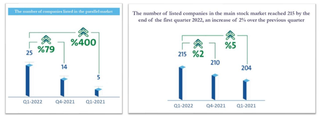
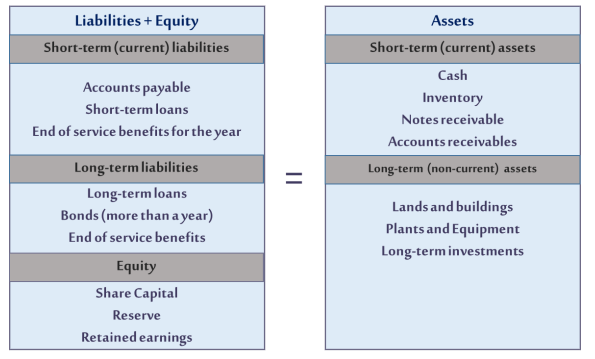
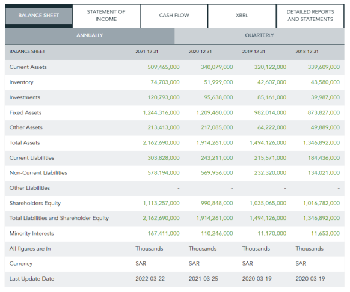
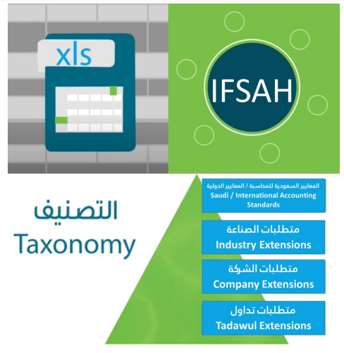

1. Types of Disclosure 26
2. Degree of Mandatory Disclosure 27
3. Quality of disclosed information 28
4. Methods of Disclosure 29
5. Preparation of the financial statements and arrangement of their items 30
6. Extensible Business Reporting Language (XBRL) 31

:::info

This part of the curriculum includes about `8` questions out of the `50` questions in the test.

:::

## 3.1 Types of Disclosure

Learning Objective:

Be familiar with the types of disclosure and to classify the disclosed information

The essence of the disclosure process is the purposeful dissemination of information from the source to the concerned public. Disclosure could be divided into several types and in different methods, as it is divided in terms of the quantity and amount of information disclosed and the purpose thereof as follows:

1- Adequate Disclosure:

This means to provide the minimum information required by the users of the financial statements. Since the investor is one of the most important categories of users of the financial statements, the Disclosure is considered as adequate when the necessary information is available for investment decisions. The information necessary for the investment decision constitutes the minimum information to be included in the financial reports.

2- Fair Disclosure:

This level is related to the ethical and moral aspects upon publishing information. The disclosure is considered as fair, when all categories of users of external financial statements are treated similarly and equally at the same time, which means providing them with the same amount of information at the same time.

3- Full Disclosure:

This type of disclosure is related to the dissemination of all information appropriate to users of financial reports, and may result in many negative effects that may affect the entities and its shareholders.

Types of disclosure according to its objectives are as follows:

4- Appropriate Disclosure

Appropriate disclosure aims to cover the need of data users.

5- Educational (Informative) Disclosure

Means to claim the disclosure of appropriate and adequate information, and not only positive information, but all appropriate and adequate information for decision-making, such as disclosing financial forecasts by separating the normal and abnormal items of the financial statements, and disclosure of current and planned capital expenditure, its sources of financing, and future strategies.

25

6- Precautionary (Traditional) Disclosure

This means that the financial reports shall disclose everything that makes such reports are not misleading to the stakeholders and are not exposing them to accountability for non-disclosure. Precautionary disclosure aims to protect users of disclosure information, in particular the ordinary investor who has a limited ability to use financial information.

## 3-2 Degree of Mandatory Disclosure

Learning Objective: Be familiar with distinguishing between mandatory and voluntary disclosure and the impact of each of them on the company's relationship with decision-makers

### 3-2-1 Mandatory Disclosure

This disclosure is subject to the provisions of the regulations issued by the supervisory authorities on the capital markets, representing the minimum information that shall be disclosed. Such disclosure may be at the expense of other information that may be important to some other users, but the regulations paid no enough attention to its publication.

### 3-2-2 Voluntary Disclosure

Voluntary disclosure may be defined as the processes of disclosing additional information in excess of the limit required by regulations and standards applied by corporate managements to meet the needs of the parties using financial reports. The management's keenness is to provide financial and non-financial information related to decision makers.

Since the voluntary disclosure is a serious attempt by companies to provide additional information that may not be stipulated by legislation, financial laws or accounting standards, financial laws or accounting standards in order to follow the principle of transparency, in order to follow the principle of transparency, and with the aim of providing as much information as possible to users of financial statements, in order not to resort to other sources of information that may be misleading. Therefore, this type of disclosure is known as informative disclosure, as the scope of the accounting disclosure is no longer limited to a mere disclaimer of the company's management, rather, expanded to include providing the largest amount of accounting information that increases the degree of confidence between management and users of financial statements.

26

## 3-3 Quality of disclosed information:

Learning Objective:

Be familiar with the ability to categorize the type of the information disclosed

Disclosure may also be classified in terms of the quality of the information disclosed as follows:

### 3-3-1 Accounting Disclosure

Accounting disclosure is defined as: “Disclosing all the information that may affect the decision-maker’s position related to the accounting unit. This means that the information shall be disclosed in the financial statements and reports in a language understandable to the reader without confusion or misleading, and the financial reports shall include all the necessary and required information to give the user of these reports a clear and correct picture of the accounting unit.

### 3-3-2 Financial Disclosure

Financial disclosure is essential if the interest is focused on providing the financial statement that would help decision-making and affect the company’s shares, especially those shares listed in the capital market. Examples of financial disclosure include the disclosure of financial decisions, expansion and financing investment plans of the company, and the company's policies for distributing profits.

### 3-3-3 Administrative Disclosure

All material information related to the board of directors and the executive management that affects the company’s business, and the board of directors shall organize the disclosures for each of its members and members of the executive management, taking into account the followings:
- Establishing a special register for the disclosures to the members of the Board of Directors and the Executive Management, and updating it periodically, in accordance with the disclosures required under the companies’ law and the capital market law and their executive regulations.
- Enabling the company's shareholders to access to the register of disclosure to the members of the Board of Directors and the Executive Management free of charge.

The Board of Directors shall immediately inform the Authority and announce on the Saudi Exchange (Tadawul) website (and as the case may require) all the legal requirements specified in the laws and regulations such as:
- Any changes in the structure of the Board of Directors (resignation, appointment or classification).
- Any changes in the structure of the company's committees.
- Any changes in the executive management, including the CEO and CFO.

27

### 3-3-4 Regulatory Disclosure

The company’s management shall disclose all information required under the corporate governance regulations issued by the authority, the companies’ law, and other regulations.

## 3-4 Methods of Disclosure

Learning Objective: Be familiar with the methods used in disclosure

The methods used to transfer information in the disclosure process aim at making the information quickly accessible to all users and without a change or distinction between the information. The methods and means used in accordance with the regulations and standards regulating the disclosure process are as follows:

### 3-4-1 Declaration

#### 3-4-1-1 Declaration on the company's website

#### 3-4-1-2 Declaration on the stock market website

  + An announcement is made on the stock market website with the aim of assisting listed companies in complying with the rules of registration and listing, especially the regulations related to continuous disclosure, in enhancing the level of transparency and disclosure in the capital market and helping investors make their investment decisions based on correct and adequate information.

#### 3-4--3 Declaration in newspapers and general magazines

### 3-4-2 Reports:

An essential tool for disseminating the company's financial information includes several types, as shown below:

3-4-2-1 Supplementary Reports and Schedules: This method is used to disclose some additional information and details that are difficult but impossible to be disclosed in the financial statements. This method may be used through notes and footnotes, or in the form of independent reports, etc.

3-4-2-2 Report of the Chairman of the Board of Directors, and this report is considered complementary to the financial statements, without which it is difficult to interpret a lot of the financial statements’ information.

3-4-2-3 Report of the External Auditor: Report of the External Auditor is a secondary disclosure method and not a main method, as it may confirm the disclosure or non-disclosure of certain information through the notes or reservations mentioned by the auditor in his report.

3-4-2-4 Annual financial reports

3-4-2-5 Periodic financial reports (quarterly, semi-annual)

3-4-2-6 Reports on material or major events

3-4-2-7 Reports on events subsequent to the submission of their financial reports

28

### 3-4-3 Forms

The forms aim to assist both listed companies and investors in fulfilling their obligations with the requirements of the Capital Market Authority related to corporate announcements, publishing financial statements and reports, disclosing the extent to which the provisions of the Corporate Governance Regulations are applied, and providing the Authority with data of board members and chief executives, in addition to the notices related to the share ownership to major owners, members of the board of directors and chief executives of listed companies.

29

## 3-5 Preparation of the financial statements and arrangement of their items

Learning Objective:

Be familiar with the items and components of financial statements as one of the most important methods of disclosure

There are many ways and method of accounting disclosure that could help users of information to understand such information and make an appropriate decision. The comparison between one method and another depends on the nature of the required information and its relative importance. The most common methods in use are as follows:

### 3-5-1 Disclosure through the financial statements:

Since the basic information are provided in the financial statements in a method that helps disclosure in terms of the form and arrangement of these lists. For example, the statement of financial position states the items of assets and liabilities (assets and liabilities) of the establishment, as well as property rights. The appropriate relationships may be disclosed by rearranging the classification of assets and liabilities into fixed and current assets and long-term and current liabilities. Current liabilities are subtracted from current assets to get the working capital, as well as other methods of subdivisions.

30

A figure illustrating the components of the statement of financial position:

31

### 3-5-2 Use of clear and well-known terms:

The use of clear terms and the amount of detail in the information is undoubtedly no less important than the disclosure in the financial statements previously referred to. Those terms expressing the precise meaning well known to users of the information should be used; taking into account the standardization of terms for the same meanings in all reports so that users of information can benefit from, otherwise the disclosure becomes misleading.

### 3-5-3 Information in brackets:

Brackets are used in the financial statements in the case of some items that cannot be understood from their titles only, without elaborating on details and prolongation. Such items can be explained as brief notes in brackets, such as the method of evaluating a specific item/mortgaged assets or making a brief explanation and other observations.

### 3-5-4 Footnotes notes

The method of notes and margins is one of the important methods of disclosure, as their information is difficult to be provided in the financial statements. However, they may not be relied upon to a large degree in disclosure instead of the financial statements.

32

## 3-6 Extensible Business Reporting Language (XBRL)

Learning Objective:

Be familiar with the concept, objectives and advantages of Extensible Business Reporting Language (XBRL)

The development of accounting performance shall keep up with the surrounding technical developments to fit the increase of users' growing needs in form and content. Users are usually interested in the accounting performance outputs of reports and financial statements.

In order to improve the processing and presentation of reports, attention should be paid to the development of accounting reporting conversion mechanisms used by data users (Accountants, auditors and financial analysts) on the one hand, and software developers on the other.

Due to the qualitative and geographical expansion of businesses and the spread of Internet use among large, medium and small business sectors alike, attention has begun to focus on the electronic exchange of accounting reports to increase the speed and accuracy of their use and improve their standards.

The use of XBRL has improved the value and timeliness of business-related information by providing smarter data instead of bulkier data.

Data users:
1) Accountants and auditors.
2) Entities and companies generating assumed documents.
3) Analysts of assumed document data.
4) Organizations and standard setters: which ensure that terminology meets the requirements of the reports they oversee.

(XBRL) is useful in the automatic translation of data cards, which will solve the multilingual obstacle that hinders the development of the efforts of many users of financial reporting data, which leads to sharing data in an electronic format. This will open the door to compare data regardless of their place of origin in the world, which will lead to an unprecedented wave of excellent, high-quality data in the global capital markets supposed to reduce the cost of invested capital or improve investment returns.

33

### 3-6-1 Use of Extensible Business Reporting Language (XBRL)

XBRL stands for Extensible Business Reporting Language. The idea of the language is to produce standardized reports whose contents can be compared worldwide. Indeed, the process of standardizing financial statements worldwide was one of the existing matters troubling all those working in the field of accounting and auditing. Such services were high-cost, but after developing this language and obligating the various authorities in the capital markets and financial companies to prepare their reports using this language, this language has become of great importance.

### 3-6-2 Extensible Business Reporting Language (XBRL) as a Financial and Accounting Disclosure Tool:

People and organizations face many problems in exchanging information, such as using different terms to describe the same matter or using the same term to describe other matters. XBRL provides the financial community with a standard method for dealing with business reports in general and with financial statements and their contents in particular, including their preparation and publication in several formats, along with providing the ability to reliably extracting and automatically exchanging a part of its data. This language is not an accounting standard but rather a numeric language intended to improve the use of existing standards.

Kurt Ramin, Chairman of the International Accounting Standards Committee and President of XBRL International, described such language as:

An international electronic standard depends on coding financial information items under international accounting standards in such a method allowing addressing, storing and processing such information electronically in any system and then easily displaying on the standard format used in presenting the financial reports.

Paying attention to the language (XBRL) has become a necessity from the point of view of the company producing the data and the beneficiaries alike. Perhaps despite the capabilities of its analysts and investors, Microsoft has the most numerous shareholders in the world, they still need to:

Review large numbers of financial statements.

Re-enter financial information into their system.
- More time.
- More analysis expenses.
- To make such information and results of its analysis accessible to the public.

Microsoft has to manually re-enter data to make information related to its companies available in print and online in order to be available to different users, whether they are government agencies, financial communities, media or the public, which increases costs and ensures the integrity and quality of that data.

34

XBRL addresses matters in two main methods:
1. Facilitating the provision of companies' financial information.
2. Facilitating the use of such information by individuals, companies, government, analysts and investors. Computer programs may do the same, as they have the ability to easily extract every piece of information from (XBRL).

For example, no computer program can extract specific information such as (total revenue for 2015) from a financial statement, as no program knows where it could search for? And is not able to know whether the number captured expresses dollars, cents or kilograms? The intervention by (XBRL) in preparing and publishing the financial statements in several formats will increase the performance of the financial statements by making them available to every person. Instead of spending ten hours studying the data and several hours in analyzing, a few moments are enough to get the data and a few hours are enough for their analysis. However, through financial analysis programs, a few minutes will be enough to get the analysis results.

35

### 3-6-3 Advantages of using the report via (XBRL):

Access to reports directly using (XBRL) technologies via (Web) services achieves the following advantages:

Better security:

The Common Reporting Language has become a digital language, as the business community seeks to exchange information on the Internet, represented in the largest organizations and stock exchanges around the world that are growing. The tempo of such transition is increased by the processes of educating clients, programmers, regulators and participants in the capital markets, and reflected in the following:

First: Globalization of information, as it formed the standard for work using internet services, and software all over the world are now able to understand and analyze the information contained in reports in (XBRL) formats.

Second: It has become a critical tool for re-engineering reporting processes inside companies and organizations through reports. The objective of transition to this tool is to help in a faster, more accurate and controllable manner, and therefore, to get more reliable information to enhance trading in the world.

Third: Such tool has flexible text reports that may contain images that could be displayed in different methods, as the information is not locked and may be moved freely and independently, as desired by consumer, as well as their analysis to include specific and non-financial measures.

Fourth: XBRL data is invested in analytics and business software, so that companies could exchange their information with each other and with the concerned parties without any delay in time, which increases the efficiency and accuracy of work and increases the understanding of information about a company, and is thus reflected in capital market analyzes and reports.

Better technology:

At no time has the business world been under more pressure to communicate faster and more accurate information among managers, customers, business partners, creditors, investors, regulators and others, than it does today. The speed and ease of access has become the key for decision makers to use the information. XBRL is the fastest method to improve access to and use of information for consumption and production through direct reports using web services.

36

Better data:

The security standards in (XBRL) and the transmission of information on the internet makes it practical in collecting and supporting information and enabling direct immediately communication between businessmen. It also improves the methods of exchanging data inside institutions and companies and between the concerned authorities, so it:
1. Facilitates the exchange of financial data.
2. Is immediately extracted.
3. Its data is more accurate, as it is directly obtained from the source.

Better business environment:

(XBRL) has made a huge difference in the quality of decision and enhanced competitiveness due to diversity, speed, accuracy and power in collecting and analyzing information, which enhanced decision-making in the management. XBRL also helped in reusing information in various forms, which enhanced its benefits in the decision-making process in several ways:
1. Velocity of circulation of events and decisions and their access to managers.
2. Increasing reliability of the information.
3. Reducing reporting costs and increasing its efficiency.

### 3-6-4 Financial reporting and improving methods of disclosure:

The use of modern technologies helps in the development of accounting and financial disclosure methods due to improving the quality and transparency of information, ensuring its reliability and securing its contents reaching the capital markets. The methods of exporting financial statements to many formats of files have spread, including (PDF and XSL) and other files published on websites in (HTML) format. However, the traditional financial report, available in PDF file formats, is difficult to be obtained and automatically extract parts of its data. To make matters worse, a lot of important information may be hidden in the notes to the financial statements.

While the financial report available in (Excel) file formats has more flexibility in terms of its processing, graphic representation, and the ability to extract and perform multiple mathematical operations on. However, it does not provide adequate capabilities globally required in presentation, representation and analysis.

37

While the financial report prepared using the language (XBRL) is characterized by the great flexibility necessary for all its beneficiaries, including:

1- Accountants:

They carefully examine, compile and summarize the internal data for use in the financial reports, which enhances their efficiency and accuracy in preparing reports and financial statements, in addition to their publication on websites and the ability to exchange their reports internally.

2- Auditors:

They review financial records, as the report allows them to focus on analyzing information, reducing errors in data, speedy processing and easy access.

3- Executive Directors:

They can use (XBRL) as a transparent and oversight means to deliver whatever they want to disclose directly to the analytical tools for investors and analysts in the form of XML reports. They can observe a reduction in potential errors and operating costs which will allow them to focus on the added value of the data.

4- Investors: They invest more confidently, so they rely on the study in making their investment decisions and benefit from the capabilities of automated analysis and from receiving information in electronic formats that can be used again.

5- Financial advisors: They provide paid financial advice to those whoever request in exchange for their analysis and understanding of financial conditions.

6- Professional organizations: they can retrieve and analyze the data of a report quickly.

7- Software developers: Their programs will adopt export and import formats compatible with (XBRL), which will increase full functions with other financial and analytical applications.

8- Technology consultants: new opportunities will be offered for IT consultants, which includes developing analysis and review programs, as tasks and responsibilities will increase and reviewers and auditors will look for more technologies to improve audit work and support it with analysis. Since auditors will examine processes and use software to perform basic audit steps on data stored as analytical tools using XBRL. At the same time, the software will facilitate the documentation of these audit reports.

38

## Questions of Chapter Three

  
Contrast the difference between adequate disclosure and fair disclosure

  

    
Adequate disclosure: the minimum information to be included in the financial reports

    
Fair disclosure: all categories of users of external financial statements are treated similarly and equally at the same time

  

1. Contrast the difference between adequate disclosure and fair disclosure

Answer reference: Section 3-1-1, 3-1-2

  
What is the type of disclosure that provides the minimum information required by users of financial reports called?

  

    
Adequate Disclosure

  

1. What is the type of disclosure that provides the minimum information required by users of financial reports called?

Answer reference: Section 3-1-1

  
What is meant by full disclosure?

  

    
The dissemination of all information appropriate to users of financial reports

  

1. What is meant by full disclosure?

Answer reference: Section 3-1-3

  
What is meant by educational (media) disclosure?

  

    
All appropriate and adequate information for decision-making, disclosure of current and planned capital expenditure, its sources of financing, and future strategies

  

1. What is meant by educational (media) disclosure?

Answer reference: Section 3-1-5

  
What is the difference between mandatory and voluntary disclosure?

  

    
Mandatory disclosure is subject to the provisions of the regulations issued by the supervisory authorities on the capital markets

    
Voluntary disclosure provision additional information in excess of the limit required by regulations

  

1. What is the difference between mandatory and voluntary disclosure?

Answer reference: Section 3-2-1, 3-2-2

  
What are the types of disclosure in terms of the quality of the information disclosed?

  

    
Accounting, financial, adinistrative, regulatory

  

1. What are the types of disclosure in terms of the quality of the information disclosed?

Answer reference: Section 3-3-1, 3-3-2

  
Contrast the difference between administrative disclosure and regulatory disclosure.

  

    
related to the company’s business; information required under the corporate governance regulations

  

1. Contrast the difference between administrative disclosure and regulatory disclosure. 3

Answer reference: Section 3-3-3, 3-3-4

  
What are the methods used in disclosure?

  

    
Declaration, reports, forms

  

1. What are the methods used in disclosure?

Answer reference: Section 3-4

  
Explain how can be the disclosure through the financial statements?

  

    
the statement of financial position states the items of assets and liabilities (assets and liabilities) of the establishment, as well as property rights

  

1. Explain how can be the disclosure through the financial statements?

Answer reference: Section 3-5-1

  
Explain how Extensible Business Reporting Language (XBRL) helps solve the multilingual problem

  

    
automatic translation of data cards

  

1.   Explain how Extensible Business Reporting Language (XBRL) helps solve the multilingual problem

Answer reference: Section 3-6-2

  
What are the advantages of using the reports via (XBRL)?

  

    
Security, data, business enviornment

  

11.  What are the advantages of using the reports via (XBRL)?

Answer reference: Section 3-6-3

39